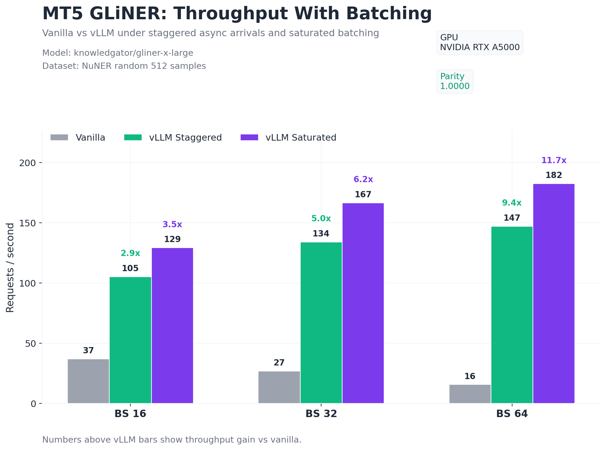
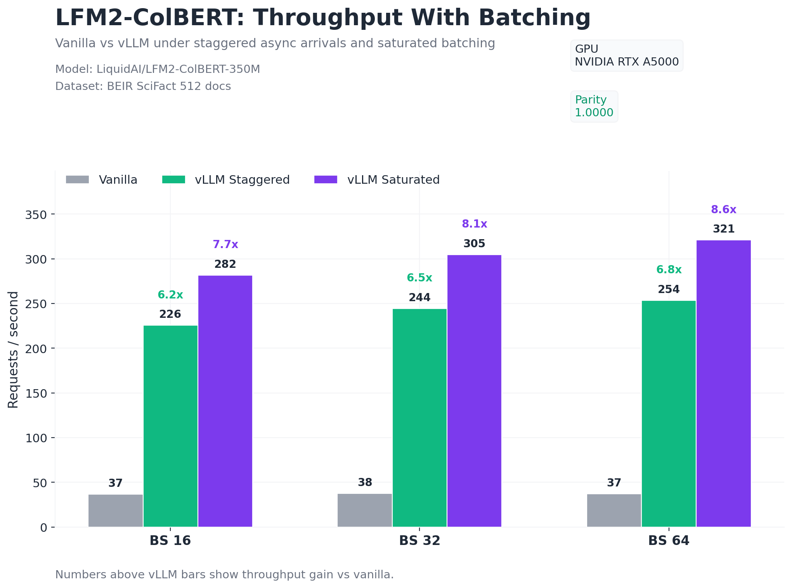
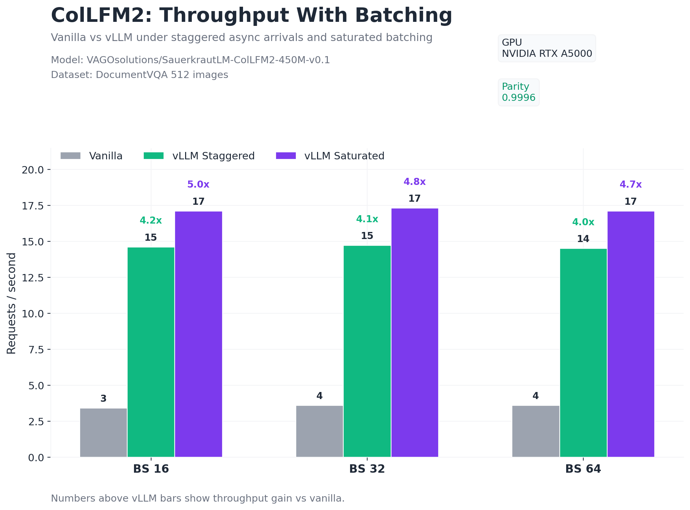
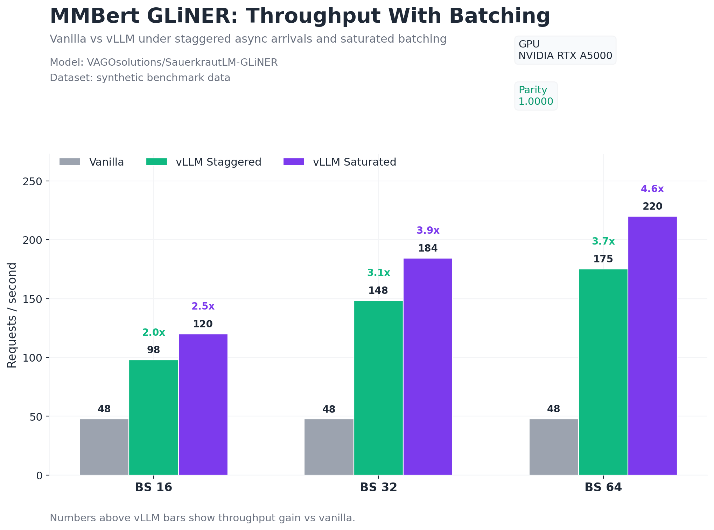
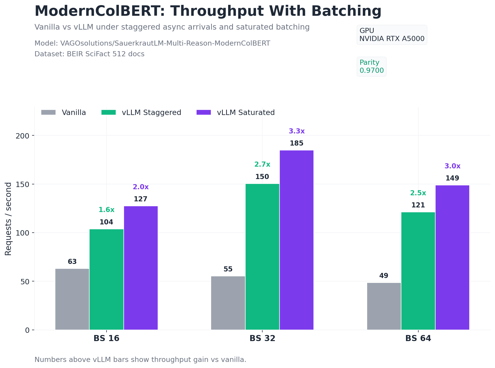
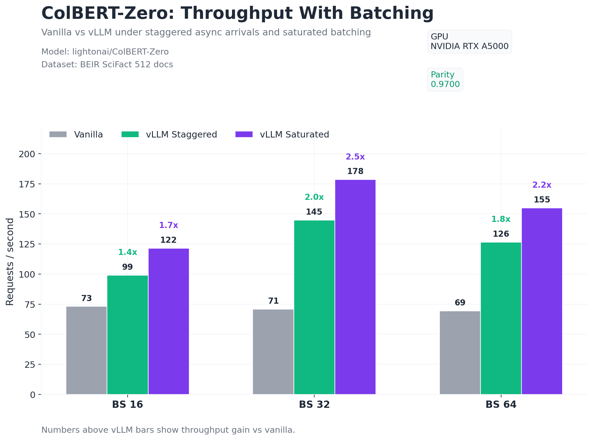
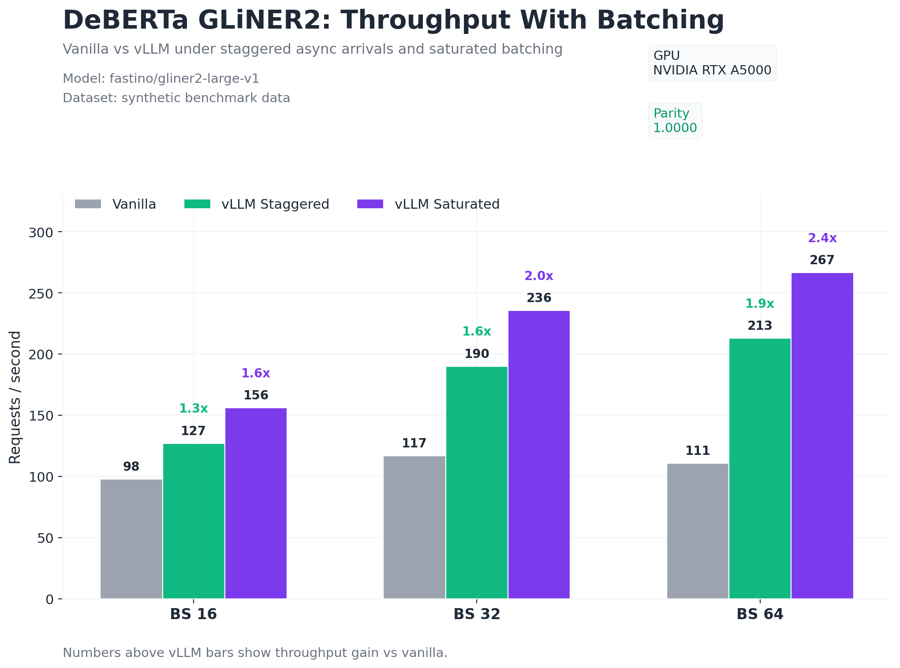

# vLLM Factory

**Production inference for encoders, poolers, and structured prediction — as vLLM plugins.**

[](https://github.com/ddickmann/vllm-factory/blob/main/LICENSE)
[](https://python.org)
[](https://github.com/vllm-project/vllm)
[](#plugins)
[](#parity)

> **12 encoder plugins · IOProcessor pre/post-processing · continuous batching · zero vLLM forks**

```bash
# Install and serve any model in 3 commands
pip install -e ".[gliner]"
pip install vllm                     # requires vLLM >= 0.19

vllm serve VAGOsolutions/SauerkrautLM-Multi-Reason-ModernColBERT \
  --runner pooling --trust-remote-code --dtype bfloat16 \
  --io-processor-plugin moderncolbert_io
```

```bash
# Query it
curl -s http://localhost:8000/pooling \
  -H "Content-Type: application/json" \
  -d '{"model":"VAGOsolutions/SauerkrautLM-Multi-Reason-ModernColBERT",
       "data":{"text":"European Central Bank monetary policy"}}'
```

---

## Benchmarks — vLLM Factory vs vanilla PyTorch

Measured on NVIDIA RTX A5000, 500 requests, 512–768 tokens, bfloat16, vLLM 0.19.0 V1 engine. Full sweep data and charts in [`bench/`](bench/).

| Model | Task | Params | Peak vLLM req/s | vs Vanilla | Parity |
|:------|:-----|-------:|:---------------:|:----------:|:------:|
| [DeBERTa GLiNER2](https://huggingface.co/fastino/gliner2-large-v1) | Schema extraction | 304M | **263 req/s** | 6.1x | 1.000 |
| [DeBERTa GLiNER Linker](https://huggingface.co/knowledgator/gliner-linker-large-v1.0) | Entity linking | 304M | **188 req/s** | 12.6x | 1.000 |
| [MMBert GLiNER](https://huggingface.co/VAGOsolutions/SauerkrautLM-GLiNER) | NER | 150M | **180 req/s** | 3.5x | 1.000 |
| [LFM2-ColBERT](https://huggingface.co/LiquidAI/LFM2-ColBERT-350M) | Retrieval | 350M | **174 req/s** | 4.6x | 1.000 |
| [MT5 GLiNER](https://huggingface.co/knowledgator/gliner-x-large) | NER | 800M | **156 req/s** | 10.2x | 1.000 |
| [ModernColBERT](https://huggingface.co/VAGOsolutions/SauerkrautLM-Multi-Reason-ModernColBERT) | Retrieval | 149M | **107 req/s** | 2.1x | 0.970 |
| [ColBERT-Zero](https://huggingface.co/lightonai/ColBERT-Zero) | Retrieval | 149M | **107 req/s** | 1.7x | 0.970 |
| [ColLFM2](https://huggingface.co/VAGOsolutions/SauerkrautLM-ColLFM2-450M-v0.1) | Multimodal retrieval | 450M | **18 req/s** | 4.9x | 0.9996 |

> **Peak vLLM req/s** = highest throughput at optimal concurrency. **vs Vanilla** = vLLM Factory req/s ÷ vanilla PyTorch req/s (batch_size=1) at peak factor. **Parity** = cosine similarity (embeddings) or entity recall (NER) vs reference. All 12/12 plugins pass parity. ModernColBERT and ColBERT-Zero share the same encoder and achieve identical vLLM throughput — the lower factor for ColBERT-Zero reflects a faster PyLate vanilla baseline, not slower vLLM performance.

<details>
<summary><b>Per-model benchmark charts</b> (click to expand)</summary>
<br>

| | |
|:---:|:---:|
|  |  |
|  |  |
|  |  |
|  |  |

</details>

---

## Why vLLM Factory?

Decoder-based LLM serving is a solved problem. Encoder-based serving is not.

Production traffic is heterogeneous: staggered requests at unpredictable intervals, mixed sequence lengths, variable batch sizes — none of it neatly padded or synchronized. Vanilla PyTorch pipelines (GLiNER, PyLate, SentenceTransformers) process requests sequentially or require manual batching. They block on each `model.forward()`, waste GPU cycles waiting for the next request, and have no scheduler to absorb traffic spikes.

**vLLM Factory bridges that gap.** Every bespoke encoder architecture — ColBERT, GLiNER, entity linking, multimodal retrieval — gets the same production-grade scheduling and memory management as a LLMs. No fork. No custom server. Just `vllm serve`.

Each plugin ships an **IOProcessor** that handles all pre- and post-processing inside the vLLM process. Clients send structured JSON (`{"data": {"text": ...}}` or `{"data": {"image": ...}}`), and the IOProcessor converts to model inputs, runs inference, and returns structured results. No client-side tokenization. No manual `extra_kwargs`. Just `POST /pooling`.

| Capability | HF / SentenceTransformers | TEI | **vLLM Factory** |
|---|:---:|:---:|:---:|
| ColBERT multi-vector retrieval | ❌ | ❌ | ✅ |
| GLiNER span-level NER | ❌ | ❌ | ✅ |
| GLiNER2 schema extraction | ❌ | ❌ | ✅ |
| Entity linking + reranking pipeline | ❌ | ❌ | ✅ |
| Multimodal retrieval (ColPali/ColQwen/Nemotron) | ❌ | ❌ | ✅ |
| Continuous batching for encoders | ❌ | ✅ | ✅ |
| CUDA graphs for encoders | ❌ | ✅ | ✅ |
| Built-in pre/post-processing (IOProcessor) | ❌ | ❌ | ✅ |
| Plugin architecture (no fork) | — | — | ✅ |
| End-to-end parity tests | — | — | ✅ |

---

## Installation

```bash
pip install vllm-factory          # from PyPI (Linux, requires CUDA)
```

Or from source for development:

### Standard install

```bash
git clone https://github.com/ddickmann/vllm-factory.git && cd vllm-factory

# Step 1: Install vllm-factory + base dependencies (+ gliner for NER/linking models)
pip install -e ".[gliner]"

# Step 2: Install vLLM (>= 0.19 required)
pip install vllm

# Step 3: Verify environment (shows detected mode and registered plugins)
python -m vllm_factory.compat.doctor
```

> **No patching required.** vLLM >= 0.19 supports `extra_kwargs` and custom
> IOProcessors natively. All 12 plugins work out of the box. Run `doctor` to confirm.

### Minimal install (no GLiNER models)

If you only need embedding or ColBERT models (no NER/linking):

```bash
pip install -e .
pip install vllm
python -m vllm_factory.compat.doctor
```

### Docker

```dockerfile
FROM vllm/vllm-openai:latest

COPY . /app/vllm-factory
WORKDIR /app/vllm-factory

RUN pip install -e ".[gliner]"
RUN python -m vllm_factory.compat.doctor

CMD ["vllm", "serve", "VAGOsolutions/SauerkrautLM-Multi-Reason-ModernColBERT", \
     "--runner", "pooling", "--trust-remote-code", "--dtype", "bfloat16", \
     "--io-processor-plugin", "moderncolbert_io"]
```

### Verify installation

```bash
make test-serve P=embeddinggemma   # Fastest model — starts server, runs test, reports pass/fail
```

---

## Serving — all 12 models

Every plugin is served with `vllm serve` + `--io-processor-plugin`. The IOProcessor handles all tokenization, formatting, and output decoding server-side. Clients send simple JSON.

### Embedding

**EmbeddingGemma** — dense CLS embeddings (300M)

```bash
vllm serve unsloth/embeddinggemma-300m \
  --runner pooling --trust-remote-code --dtype bfloat16 \
  --no-enable-prefix-caching \
  --io-processor-plugin embeddinggemma_io
```

```bash
curl -s http://localhost:8000/pooling \
  -H "Content-Type: application/json" \
  -d '{"model":"unsloth/embeddinggemma-300m",
       "data":{"text":"What is the knapsack problem?"}}'
```

### Late Interaction / Retrieval

**ModernColBERT** — multi-vector ColBERT (ModernBERT backbone)

```bash
vllm serve VAGOsolutions/SauerkrautLM-Multi-Reason-ModernColBERT \
  --runner pooling --trust-remote-code --dtype bfloat16 \
  --no-enable-prefix-caching --no-enable-chunked-prefill \
  --io-processor-plugin moderncolbert_io
```

```bash
curl -s http://localhost:8000/pooling \
  -H "Content-Type: application/json" \
  -d '{"model":"VAGOsolutions/SauerkrautLM-Multi-Reason-ModernColBERT",
       "data":{"text":"European Central Bank monetary policy"}}'
```

**LFM2-ColBERT** — Mamba/SSM hybrid ColBERT (350M)

```bash
vllm serve LiquidAI/LFM2-ColBERT-350M \
  --runner pooling --trust-remote-code --dtype bfloat16 \
  --no-enable-prefix-caching --no-enable-chunked-prefill \
  --io-processor-plugin lfm2_colbert_io
```

```bash
curl -s http://localhost:8000/pooling \
  -H "Content-Type: application/json" \
  -d '{"model":"LiquidAI/LFM2-ColBERT-350M",
       "data":{"text":"Mamba state-space model architecture"}}'
```

### Multimodal Retrieval (text + vision)

**ColQwen3** — Qwen3-VL + ColPali (1.7B)

```bash
vllm serve VAGOsolutions/SauerkrautLM-ColQwen3-1.7b-Turbo-v0.1 \
  --runner pooling --trust-remote-code --dtype bfloat16 \
  --no-enable-prefix-caching --no-enable-chunked-prefill \
  --max-model-len 8192 --limit-mm-per-prompt '{"image": 1}' \
  --io-processor-plugin colqwen3_io
```

```bash
# Text query
curl -s http://localhost:8000/pooling \
  -H "Content-Type: application/json" \
  -d '{"model":"VAGOsolutions/SauerkrautLM-ColQwen3-1.7b-Turbo-v0.1",
       "data":{"text":"What does the revenue chart show?", "is_query": true}}'

# Image document
curl -s http://localhost:8000/pooling \
  -H "Content-Type: application/json" \
  -d '{"model":"VAGOsolutions/SauerkrautLM-ColQwen3-1.7b-Turbo-v0.1",
       "data":{"image":"https://example.com/document.png", "is_query": false}}'
```

**ColLFM2** — LFM2-VL + ColPali (450M, multimodal)

```bash
vllm serve VAGOsolutions/SauerkrautLM-ColLFM2-450M-v0.1 \
  --runner pooling --trust-remote-code --dtype bfloat16 \
  --no-enable-prefix-caching --no-enable-chunked-prefill \
  --io-processor-plugin collfm2_io
```

```bash
curl -s http://localhost:8000/pooling \
  -H "Content-Type: application/json" \
  -d '{"model":"VAGOsolutions/SauerkrautLM-ColLFM2-450M-v0.1",
       "data":{"text":"Summarize the table contents"}}'
```

**Nemotron-ColEmbed** — bidirectional Qwen3-VL (4B, multimodal)

```bash
vllm serve nvidia/nemotron-colembed-vl-4b-v2 \
  --runner pooling --trust-remote-code --dtype bfloat16 \
  --no-enable-prefix-caching --no-enable-chunked-prefill \
  --io-processor-plugin nemotron_colembed_io
```

```bash
curl -s http://localhost:8000/pooling \
  -H "Content-Type: application/json" \
  -d '{"model":"nvidia/nemotron-colembed-vl-4b-v2",
       "data":{"text":"Neural network optimization techniques", "is_query": true}}'
```

### Named Entity Recognition (GLiNER)

GLiNER models use custom model directories prepared by `forge/model_prep.py`. The IOProcessor handles all NER preprocessing (tokenization, span generation) and postprocessing (entity decoding) server-side.

> Requires `pip install -e ".[gliner]"` at install time.

**mmbert_gliner** — ModernBERT + GLiNER span head

```bash
# Prepare model (one-time)
vllm-factory-prep --model VAGOsolutions/SauerkrautLM-GLiNER --output /tmp/sauerkraut-gliner-vllm

# Serve
vllm serve /tmp/sauerkraut-gliner-vllm \
  --runner pooling --trust-remote-code --dtype bfloat16 \
  --no-enable-prefix-caching --no-enable-chunked-prefill \
  --io-processor-plugin mmbert_gliner_io
```

```bash
curl -s http://localhost:8000/pooling \
  -H "Content-Type: application/json" \
  -d '{"model":"/tmp/sauerkraut-gliner-vllm",
       "data":{
         "text":"Apple Inc. announced a partnership with OpenAI. Tim Cook presented at WWDC 2024.",
         "labels":["company","person","event"],
         "threshold":0.3
       }}'
```

Returns: `{"data": [{"text": "Apple Inc.", "label": "company", "score": 0.95}, ...]}`

**mt5_gliner** — mT5 encoder + multilingual GLiNER

```bash
vllm-factory-prep --model knowledgator/gliner-x-large --output /tmp/gliner-x-large-vllm

vllm serve /tmp/gliner-x-large-vllm \
  --runner pooling --trust-remote-code --dtype bfloat16 \
  --no-enable-prefix-caching --no-enable-chunked-prefill \
  --io-processor-plugin mt5_gliner_io
```

**deberta_gliner** — DeBERTa v2 + GLiNER span head

```bash
vllm-factory-prep --model urchade/gliner_small-v2.1 --output /tmp/gliner-pii-vllm

vllm serve /tmp/gliner-pii-vllm \
  --runner pooling --trust-remote-code --dtype bfloat16 \
  --no-enable-prefix-caching --no-enable-chunked-prefill \
  --io-processor-plugin deberta_gliner_io
```

**deberta_gliner2** — DeBERTa v3 + GLiNER2 schema extraction

```bash
vllm-factory-prep --model fastino/gliner2-large-v1 --output /tmp/gliner2-vllm

vllm serve /tmp/gliner2-vllm \
  --runner pooling --trust-remote-code --dtype bfloat16 \
  --no-enable-prefix-caching --no-enable-chunked-prefill \
  --io-processor-plugin deberta_gliner2_io
```

### Entity Linking & Reranking

**deberta_gliner_linker** — dual DeBERTa + LSTM + scorer (L3)

```bash
vllm serve plugins/deberta_gliner_linker/_model_cache \
  --runner pooling --trust-remote-code --dtype bfloat16 \
  --no-enable-prefix-caching --no-enable-chunked-prefill \
  --io-processor-plugin deberta_gliner_linker_io
```

```bash
curl -s http://localhost:8000/pooling \
  -H "Content-Type: application/json" \
  -d '{"model":"plugins/deberta_gliner_linker/_model_cache",
       "data":{
         "text":"Tesla announced record earnings in Austin.",
         "labels":["company","location"],
         "threshold":0.3,
         "candidate_labels":["Tesla Inc.","Austin, TX","TSLA"]
       }}'
```

**modernbert_gliner_rerank** — ModernBERT + projection + LSTM + scorer (L4)

```bash
vllm serve plugins/modernbert_gliner_rerank/_model_cache \
  --runner pooling --trust-remote-code --dtype bfloat16 \
  --no-enable-prefix-caching --no-enable-chunked-prefill \
  --io-processor-plugin modernbert_gliner_rerank_io
```

---

## Plugins

### Embedding

| Plugin | Architecture | Checkpoint | Params |
|---|---|---|---|
| `embeddinggemma` | Gemma + CLS projection | [`unsloth/embeddinggemma-300m`](https://huggingface.co/unsloth/embeddinggemma-300m) | 300M |

### Late Interaction / Retrieval

| Plugin | Architecture | Checkpoint | Params |
|---|---|---|---|
| `moderncolbert` | ModernBERT + ColBERT | [`VAGOsolutions/SauerkrautLM-Multi-Reason-ModernColBERT`](https://huggingface.co/VAGOsolutions/SauerkrautLM-Multi-Reason-ModernColBERT) | 149M |
| `lfm2_colbert` | LFM2 (Mamba/SSM) + ColBERT | [`LiquidAI/LFM2-ColBERT-350M`](https://huggingface.co/LiquidAI/LFM2-ColBERT-350M) | 350M |
| `colqwen3` | Qwen3-VL + ColPali (vision) | [`VAGOsolutions/SauerkrautLM-ColQwen3-1.7b-Turbo-v0.1`](https://huggingface.co/VAGOsolutions/SauerkrautLM-ColQwen3-1.7b-Turbo-v0.1) | 1.7B |
| `collfm2` | LFM2-VL + ColPali (vision) | [`VAGOsolutions/SauerkrautLM-ColLFM2-450M-v0.1`](https://huggingface.co/VAGOsolutions/SauerkrautLM-ColLFM2-450M-v0.1) | 450M |
| `nemotron_colembed` | Qwen3-VL bidirectional + ColBERT | [`nvidia/nemotron-colembed-vl-4b-v2`](https://huggingface.co/nvidia/nemotron-colembed-vl-4b-v2) | 4B |

### Named Entity Recognition (GLiNER)

| Plugin | Architecture | Checkpoint | Params |
|---|---|---|---|
| `mmbert_gliner` | ModernBERT + GLiNER span head | [`VAGOsolutions/SauerkrautLM-GLiNER`](https://huggingface.co/VAGOsolutions/SauerkrautLM-GLiNER) | 150M |
| `deberta_gliner` | DeBERTa v2 + GLiNER span head | [`urchade/gliner_small-v2.1`](https://huggingface.co/urchade/gliner_small-v2.1) | 166M |
| `mt5_gliner` | mT5 encoder + multilingual GLiNER | [`knowledgator/gliner-x-large`](https://huggingface.co/knowledgator/gliner-x-large) | 800M |
| `deberta_gliner2` | DeBERTa v3 + GLiNER2 schema extraction | [`fastino/gliner2-large-v1`](https://huggingface.co/fastino/gliner2-large-v1) | 304M |

### Entity Linking & Reranking

| Plugin | Architecture | Checkpoint | Params |
|---|---|---|---|
| `deberta_gliner_linker` | Dual DeBERTa + LSTM + scorer | [`knowledgator/gliner-linker-large-v1.0`](https://huggingface.co/knowledgator/gliner-linker-large-v1.0) | 304M |
| `modernbert_gliner_rerank` | ModernBERT + projection + LSTM | [`knowledgator/gliner-linker-rerank-v1.0`](https://huggingface.co/knowledgator/gliner-linker-rerank-v1.0) | 68M |

### Encoder Backbones (no pooler yet)

| Model | Architecture | Checkpoint | Params | Status |
|---|---|---|---|---|
| `t5gemma2` | T5-Gemma2 encoder-decoder (text + vision) | [`google/t5gemma-2-270m-270m`](https://huggingface.co/google/t5gemma-2-270m-270m) | 270M+270M | Encoder + decoder backbone, full HF parity, custom Triton kernels. No pooler/IOProcessor yet -- available as a building block for downstream tasks (ColPali, GLiNER, OCR, etc.). See [`models/t5gemma2/README.md`](models/t5gemma2/README.md). |

---

## Parity — all 12 plugins validated

Every plugin passes end-to-end parity testing: `vllm serve` → HTTP request → compare against reference implementation. No smoke tests — real model inference, real outputs.

**NER models** are validated by comparing actual entity text and labels (not counts). The gating metric is **recall** — every reference entity must be found by vLLM. vLLM finding extra entities is acceptable. Entity confidence scores are compared informally (score deltas reported but not gating, since dtype rounding produces small drift).

**Embedding/ColBERT models** are validated by element-wise cosine similarity of the full output vector against reference tensors from the vanilla library.

All models run in **bfloat16**.

| Plugin | Reference | Metric | Score |
|---|---|---|---|
| `embeddinggemma` | HF SentenceTransformer | cosine sim | **1.0000** |
| `mmbert_gliner` | GLiNER library | recall (entity text+label) | **1.000** |
| `deberta_gliner` | GLiNER library | recall (entity text+label) | **1.000** |
| `deberta_gliner2` | GLiNER2 library | recall (entity text+label) | **1.000** |
| `mt5_gliner` | GLiNER library | recall (entity text+label) | **1.000** |
| `deberta_gliner_linker` | Knowledgator GLinker | recall + link match | **1.000** |
| `modernbert_gliner_rerank` | Knowledgator GLinker | recall (entity text+label) | **1.000** |
| `moderncolbert` | PyLate | cosine sim | **0.970** |
| `lfm2_colbert` | HF transformers | cosine sim | **1.000** |
| `collfm2` | sauerkrautlm-colpali | cosine sim | **0.9996** |
| `colqwen3` | sauerkrautlm-colpali | cosine sim | **0.9966** |
| `nemotron_colembed` | HF transformers | cosine sim | **0.9997** |

```bash
python scripts/serve_parity_test.py                # all 12 plugins
python scripts/serve_parity_test.py --plugin colqwen3  # single plugin
```

---

## How it works

### Architecture: FactoryIOProcessor + FactoryPooler

Each plugin registers a **FactoryIOProcessor** (subclass of vLLM's `IOProcessor`) for pre/post-processing and a **FactoryPooler** for task-specific business logic. A single **VllmPoolerAdapter** bridges pooler logic to vLLM's internal pooler ABC. No client-side tokenization needed.

```
POST /pooling {"data": {"text": "..."}}
    │
    ▼
┌─────────────────────────────────────────────────────────────┐
│  FactoryIOProcessor                                         │
│    .parse_request()       → typed input                     │
│    .factory_pre_process() → tokenized prompt + extra_kwargs │
│    engine.encode()        → model forward                   │
│      └─ VllmPoolerAdapter → FactoryPooler.forward()         │
│    .factory_post_process()→ structured output               │
│    .output_to_response()  → JSON response                   │
└─────────────────────────────────────────────────────────────┘
    │
    ▼
{"data": [{"text": "Apple Inc.", "label": "company", "score": 0.95}, ...]}
```

The **FactoryPooler** protocol (`vllm_factory/pooling/protocol.py`) has zero vLLM imports — all pooler business logic is decoupled from vLLM internals. The **VllmPoolerAdapter** (`vllm_factory/pooling/vllm_adapter.py`) is the single coupling point.

### Custom Triton Kernels

| Kernel | What it optimizes |
|---|---|
| `flash_deberta_attention` | Fused c2p + p2c disentangled relative position bias for DeBERTa |
| `flash_t5gemma2_attention` | Tiled flash attention with softcapping, asymmetric sliding window, GQA, merged self+cross for T5Gemma2 (1.48x speedup) |
| `fused_qk_norm_rope` | GemmaRMSNorm + RoPE fused in single pass per head vector for T5Gemma2 (1.10x speedup) |
| `fused_glu_mlp` | Fused GeGLU chunk + GELU + mul + dropout |
| `fused_rope_global` | RoPE for ModernBERT global attention layers |
| `fused_rope_local` | RoPE for ModernBERT sliding-window local attention |
| `fused_layernorm` | Single-pass mean/var/normalize + affine |
| `fused_dropout_residual` | In-place dropout + residual add |

### Repository structure

```
vllm-factory/
├── plugins/              # 12 model plugins (each with io_processor.py + parity_test.py)
├── models/               # Encoder backbones (DeBERTa, ModernBERT, mT5, T5Gemma2, ...)
├── kernels/              # Custom Triton kernels
├── poolers/              # Shared pooler heads (ColBERT, GLiNER, ColPali, linker)
├── vllm_factory/         # Core abstractions (FactoryPooler protocol, VllmPoolerAdapter, compat layer)
├── forge/                # Shared infrastructure (model_prep, server utilities)
├── bench/                # Benchmark framework with automated sweeps and chart generation
├── examples/             # Ready-to-run example scripts
├── scripts/              # Parity test orchestrator, reference generators
├── Makefile              # install · serve · test · bench · lint
└── pyproject.toml        # All 12 plugins registered as vLLM entry points
```

---

## Building custom plugins

See [`docs/PLUGIN_GUIDE.md`](docs/PLUGIN_GUIDE.md) for the step-by-step walkthrough.

A new plugin needs:

| File | Purpose |
|---|---|
| `config.py` | HuggingFace-compatible config (dimensions, layers) |
| `model.py` | Encoder forward path + `self.pooler` wiring |
| `io_processor.py` | Subclass `FactoryIOProcessor` — parse, pre-process, post-process, response |
| `pooler.py` | Implement `FactoryPooler` protocol (zero vLLM imports) or re-export shared pooler |
| `parity_test.py` | Validation against reference implementation |

---

## Why it's fast

**Vanilla PyTorch blocks.** One `model.forward()` at a time. If request B arrives while request A is mid-inference, B waits. Under staggered, heterogeneous load — which is what production actually looks like — GPU utilization craters.

**vLLM schedules.** Incoming requests are continuously batched by the async scheduler. Variable-length sequences are packed efficiently via PagedAttention. CUDA graphs eliminate kernel launch overhead. The GPU stays saturated regardless of arrival pattern.

vLLM Factory brings this to every encoder architecture with zero custom serving code.

#### Measured speedups

See [benchmark table above](#benchmarks--vllm-factory-vs-vanilla-pytorch) for the full results — up to **11.7x throughput** at peak concurrency with zero accuracy loss.

---

## Design principles

- **No vLLM forks** — plugins, not patches
- **Parity before performance** — every optimization validated against reference
- **IOProcessor-first** — all pre/post-processing runs server-side
- **Decoupled pooler logic** — `FactoryPooler` protocol has zero vLLM imports; a single `VllmPoolerAdapter` bridges to vLLM's internals
- **Task-aware architecture** — backbone + pooler + IOProcessor = single deployment contract

---

## Requirements

- Python 3.11+
- PyTorch 2.0+
- vLLM >= 0.19
- NVIDIA GPU with CUDA support (production)
- Triton 2.0+ (for custom kernels, optional)
- macOS users: see [`docs/macos_vllm.md`](docs/macos_vllm.md) for local dev setup (CPU only, no production serving)

## Known Limitations (0.2.0)

### Runtime Monkey-Patches

Two scoped monkey-patches remain in 0.2.0. Both are idempotent, applied in model `__init__` (not at import time), and transparently documented in-code with "WHY / CHARACTERISTICS / UPSTREAM RESOLUTION" sections.

| Patch | Scope | Purpose | Remove When |
|---|---|---|---|
| `GPUModelRunner._preprocess` | GLiNER linker + rerank plugins | Forwards `attention_mask` from `extra_kwargs` into model forward, so DeBERTa correctly masks padding positions | vLLM forwards all `extra_kwargs` keys into `model_kwargs` natively |
| `Attention.get_kv_cache_spec` | `nemotron_colembed` only | Returns `None` for `ENCODER_ONLY` attention layers to skip unnecessary KV cache allocation | vLLM returns `None` for encoder-only layers natively |

### GLiNER High-Concurrency Throughput

GLiNER models show 10–30% throughput reduction at high concurrency (c≥32) compared to 0.1.x on vLLM 0.15.1. This is attributed to vLLM 0.19's V1 engine IPC overhead for serializing `extra_kwargs` payloads over ZMQ. Single-request latency is on par or better. ColBERT models (which use `PassthroughPooler` and the native token embedding path) are not affected.

### Partial Benchmark Coverage

`colqwen3` and `nemotron_colembed` were verified for model loading and parity but not full-benchmark throughput tested in this release cycle due to environment constraints.

---

## Enterprise support

Running vLLM Factory in production? [Latence AI](https://latence.ai) provides custom plugin development, performance optimization, and deployment review.

**→ [hello@latence.ai](mailto:hello@latence.ai) · [GitHub Issues](https://github.com/ddickmann/vllm-factory/issues)**

## Contributing

See [`CONTRIBUTING.md`](CONTRIBUTING.md).

```bash
make install       # install everything (correct dep order)
make serve P=name  # serve a plugin
make test P=name   # run parity test
make lint          # ruff check
```

## Who is this for?

- **Model builders** shipping encoder-based models on HuggingFace — you want users to deploy your ColBERT, GLiNER, or embedding model at production throughput without writing a custom server.
- **ML engineers** running retrieval, NER, or entity linking in production — you need continuous batching, stable latency under load, and structured JSON responses without client-side tokenization.
- **Platform teams** evaluating encoder serving infrastructure — you need a plugin architecture that supports new models without forking the serving engine, with parity-validated outputs and reproducible benchmarks.

## Roadmap

- [x] ~~Upstream pooling protocol changes to vLLM to reduce runtime patch dependency~~ — native IOProcessor path on vLLM >= 0.19 eliminates the patch for all 12 plugins
- [x] ~~Decouple pooler logic from vLLM internals~~ — `FactoryPooler` protocol with zero vLLM imports, single `VllmPoolerAdapter` bridge (0.2.0)
- [ ] Expand benchmark sweeps to ColQwen3, Nemotron-ColEmbed, and EmbeddingGemma
- [ ] HuggingFace demo Space — pick a model, type text, see embeddings/entities served by vLLM Factory
- [ ] CI benchmark automation — run throughput + parity on every PR, publish results to GitHub Pages
- [ ] Plugin authoring template with validation tooling and step-by-step generator
- [ ] Upstream the 2 remaining monkey-patches (attention_mask forwarding, KV cache skip) to vLLM core

Track progress in [GitHub Issues labeled `roadmap`](https://github.com/ddickmann/vllm-factory/issues?q=label%3Aroadmap).

## Feedback and benchmark requests

Want your encoder model benchmarked? [Open an issue](https://github.com/ddickmann/vllm-factory/issues/new) with the HuggingFace model ID and we'll add it to the queue. Include the task type (embedding, retrieval, NER, entity linking) and any specific concurrency or sequence length you care about.

For bugs, feature requests, or plugin development questions, use [GitHub Issues](https://github.com/ddickmann/vllm-factory/issues) or [Discussions](https://github.com/ddickmann/vllm-factory/discussions).

## Acknowledgements

| Project | Authors | Contribution |
|---|---|---|
| [vLLM](https://github.com/vllm-project/vllm) | vLLM Team | High-throughput serving engine |
| [GLiNER](https://github.com/urchade/GLiNER) | Urchade Zaratiana et al. | Generalist NER architecture |
| [FlashDeBERTa](https://github.com/Knowledgator/FlashDeBERTa) | Knowledgator | Triton kernel for DeBERTa attention |
| [GLinker](https://github.com/Knowledgator/GLinker) | Knowledgator | Entity linking architecture |
| [PyLate](https://github.com/lightonai/pylate) | LightOn AI | ColBERT training/inference reference |
| [sauerkrautlm-colpali](https://github.com/VAGOsolutions/sauerkrautlm-colpali) | VAGO Solutions | ColQwen/ColPali models |
| [NV-Retriever](https://arxiv.org/abs/2602.03992) | NVIDIA | Nemotron-ColEmbed architecture |
| [LFM2](https://www.liquid.ai/) | Liquid AI | LFM2 Mamba/SSM hybrid models |
| [ColBERT](https://github.com/stanford-futuredata/ColBERT) | Omar Khattab (Stanford) | Late-interaction retrieval paradigm |
| [ColPali](https://arxiv.org/abs/2407.01449) | Illuin Technology | Vision-language retrieval |
| [ModernBERT](https://arxiv.org/abs/2412.13663) | Answer.AI & LightOn | Modern BERT architecture |

## License

Apache 2.0
